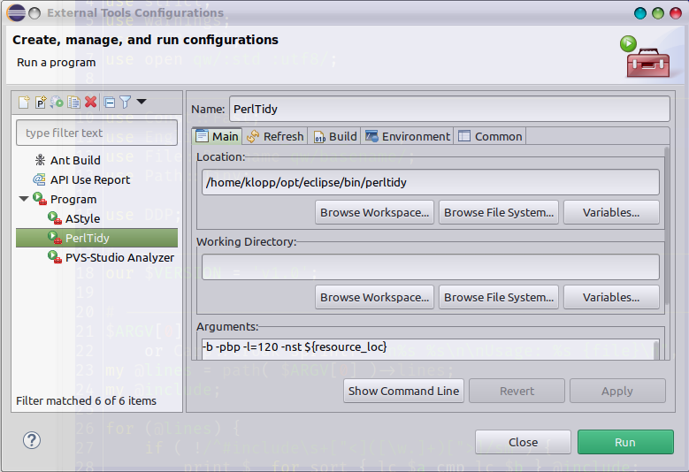
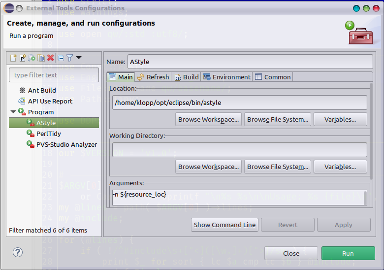

# c-include-sort.pl

Сортирует блоки `#include ...` по алфавиту.

# perl-use-sort.pl

Сортирует блоки `use ...` по алфавиту.

# perltidy

Замена системного `perltidy`.
Предварительно сортирует блоки `use ...` по алфавиту.

Использование:

```bash
    perltidy [аргументы /usr/bin/perltidy] имя_файла
```

В Eclipse:



# astyle

Замена системного `astyle` ([Artistic Style](https://astyle.sourceforge.net/)).
Предварительно сортирует блоки `#include  ...` по алфавиту.

Использование:

```bash
    astyle [аргументы /usr/bin/astyle] имя_файла
```

В Eclipse:

